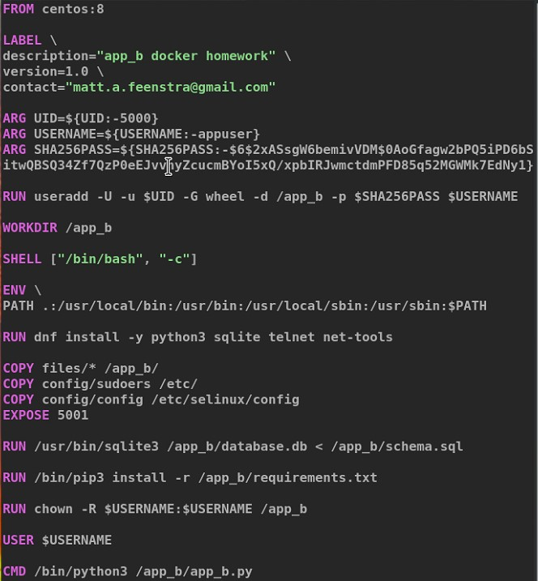
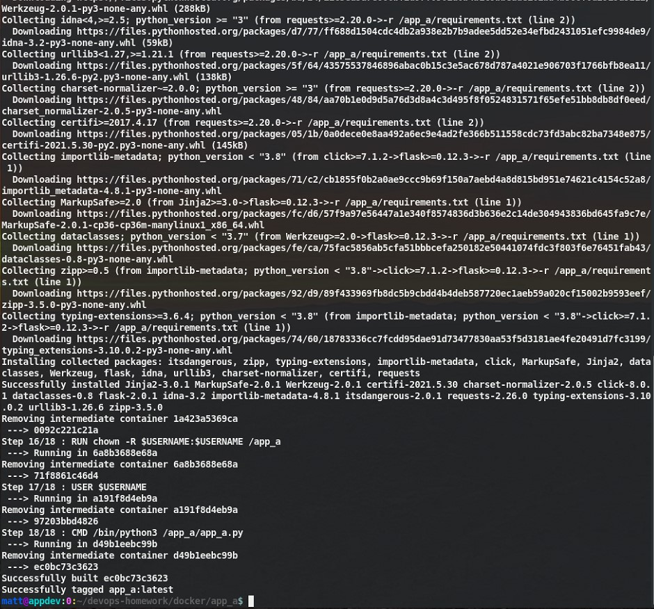

# Density DevOps Homework Assignment (by Matt Feenstra)

## Goal

Your goal is to show how you would build, test, scale, and deploy the included application on [Hashicorp Nomad](https://www.nomadproject.io/).

-----

# UPDATE:


## Build

1. Build my Docker Engine instance which also hosts Nomad single node server
- For this I have also built my own Docker Registry
- The instance builds are fully automated using CentOS with KVM and Chef
- Install Nomad with Python and required dependencies on the instance.
- Create a Dockerfile for app_a and app_b with consideration for access, interconnectivity, security, and package dependencies

## 1. Config Mgmt: Docker (docker-engine01):


## 2. Config Mgmt: Docker Container Registry (dcr):


## 3. Nomad Folder And Scripts:

1.  For the service, I have used a simple `nohup` command and piped the output to `./nomad/agent.log`

2.  The job is described in `./nomad/homework_app.hcl`

- [./nomad/job_status.sh](./nomad/job_status.sh)
- [./nomad/run.sh](./nomad/run.sh)
- [./nomad/server_start.sh](./nomad/server_start.sh)
- [./nomad/server_status.sh](./nomad/server_status.sh)
- [./nomad/server_stop.sh](./nomad/server_stop.sh)
- [./nomad/stop_job.sh](./nomad/stop_job.sh)
- [./nomad/testplan.sh](./nomad/testplan.sh)
- [./nomad/homework_app.hcl](./nomad/homework_app.hcl)


## 4. Nomad Web User Interface and Topology:


## 5. Dockerfiles

1.  **app_a**

[./docker/app_a/Dockerfile](./docker/app_a/Dockerfile)


2.  **app_b**

[./docker/app_b/Dockerfile](./docker/app_b/Dockerfile)



## 6. Docker Container Builds (2) for app_a and app_b

1.  **app_a**

[./docker/app_a/build.sh](./docker/app_a/build.sh)




2.  **app_b**

[./docker/app_b/build.sh](./docker/app_b/build.sh)


##  8. Push Containers to Registry (app_a, app_b)

1.  **app_a**


2. **app_b**


##  9.  Run Containers

1. **app_a**


2. **app_b**


## 10.  Nomad Test Plan and Deployment


## 11.  HashiCorp Configuration (HCL) for Nomad Job, Tasks, and Network

1.  Here we are using the Host network loopback.  The app_b is configured to piggyback on the network stack from app_a, as if they share the same network device (which has NAT to the host).

** It may be useful to use the --


[./nomad/homework_app.hcl](./nomad/homework_app.hcl)


## 12.  Scaling HashiCorp Nomad and Application Docker Containers

1.  Scaling requirements and resources can be configured with the `scaling` Stanza in the Job (HCL) file.  Placed at either the group-level for horizontal application scaling, or at the task level for dynamic application sizing.  The scaling block must include which resources will be controlled, from the two options `cpu` and `mem`.  Hashicorp's `Nomad Autoscaler` is an additional daemon that requires installation for enabling the functionality.

__`docker pull hashicorp/nomad-autoscaler`__

[hashicorp/nomad-autoscaler]: https://hub.docker.com/r/hashicorp/nomad-autoscaler "hashicorp/nomad-autoscaler"


## 13.  Continuous Integration and Operations


For continuous delivery, any integration pipeline tool could be used (ie: Jenkins, CircleCI, GitLab, TeamCity.  Additionally, jFrog artifactory is a vendor-supplied software package repo and also supports a Docker Registry.  Personally, I tend to use the open source docker registry software as provided from the source.  In lieu of a CI tooling packge, one could even write command line scripts to fire off the chain of events, just depending on the the level of sophistication and visibility needed.

The order of operations would go something like the following:
-  branching of the code, behavioral/test driven development, unit testing
-  communication and business requirements review
-  version control, process, acceptance and merging of code into the workflow
-  code merge may trigger a webhook to start the CI pipeline, which kicks off:
-  git clone of the repository on a slave machine
-  build of the docker image
-  push the container(s) to a registry
-  use environment variables and/or templating language for generation of the job gcl
   -  version incrementation and environment-specific configuration goes here
   -  provisioning of virtual machines if necessary
-  running the job hcl with nomad and allocating the deployment
-  testing and validation (integration testing, acceptance testing)
-  possibly utilizing a dashboard for A/B or environment-specific deployments with incrementing versions.  Additionally there is the auto-scaling and distribution across multiple (virtual) data centers.


## Assignment

Your task is to accomplish the following:

- Build a small Nomad test cluster either locally or or in the cloud, single node is fine.
- Build Docker files for both sample applications (applications must return correct results).
- Build a deployment mechanism for Nomad's [docker driver](https://www.nomadproject.io/docs/drivers/docker), this should include basic .hcl files for both applications.
- Brainstorm a plan for continuous delivery for Nomad, discuss the specific tools you'd look at and your evaluation criteria for them.

## Don't Let the Dog Eat Your Homework

For delivery of this assignment, we'd like to see:

- A Dockerfile for each application
- Simple implementation of Nomad (locally or in a public cloud)
- Repeatable deployment mechanism for each application
- Notes on Continuous Delivery for the Nomad ecosystem
- Brief discussion of Nomad as a container platform - note strengths and weaknesses vs more common options (e.g. Kubernetes)

Create a new repo using your Github account with a unique name and send us the final product!


## Notes

- Please do not fork or submit a PR to this repo
- Please document your thought-processes and use well-written git commit messages to show your progress
- Feel free to change the python application and its requirements in any way you see fit
- We are purposefully not being overly prescriptive in this assignment, as we want you to think creatively about the solution
- This assignment should take less than 5 hours to complete
- If you get stuck or need more information, please reach out for clarity
- Have fun!

## Getting Started in Local Development

Please create and source your virtualenv before beginning. 

Running the apps locally:
```
pip install -r requirements.txt
sqlite3 database.db < schema.sql
python app_a.py
python app_b.py
```

Making a request
```
curl -X POST -H 'Authorization: mytoken' http://127.0.0.1:5000/jobs
```

Simulating a lot of requests
```
ab -m POST -H "Authorization: mytoken" -n 500 -c 4 http://127.0.0.1:5000/jobs
```
